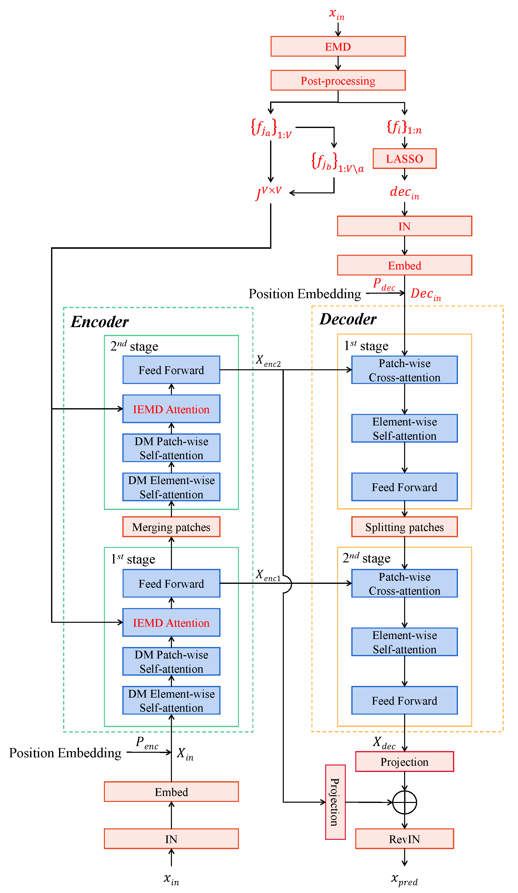

# FPPformerV2: EMD-Based Short Input Long Sequence Time-Series Forecasting


This is the origin Pytorch implementation of FPPformerV2 in the following paper: 
[FPPformerV2: EMD-Based Short Input Long Sequence Time-Series Forecasting] (Manuscript submitted to IEEE TNNLS).

## Model Architecture
The schematic in Figure 1 unveils the architecture of FPPformerV2. Compared with the former version, its encoder gets a novel attention mechanism. It is dubbed IEMD attention as it extracts the inter-relationships of different variables on the basis of EMD, which plays the role of a discriminator to determine whether the arbitrary variable pair owns underlying inter-relationship or not. IEMD attention is arranged at the end of each encoder stage, accompanied with a conventional feed-forward layer, to maintain the hierarchical architecture of the encoder and utilize the fully extracted sequence features of each variable provided by the preceding element-wise and patch-wise attention. The inter-relationships of different variables in IEMD attention are extracted in the patch level, rather than the entire sequence level, to economizes the computational cost. Besides, the decoder receives a hybrid of seasonal signals, whose periods are identified from the IMFs of input sequences, in lieu of a simple zero-initialized tensor. Instance normalization, which a prevailing technique proposed by T. Kim et al., is applied to it like the input of encoder to ensure the identical distribution of input and prediction sequence. IEMD attention is no longer deployed in decoder since the encoder has already extracted the inter-relationships of input sequences from all variables, whose existences are determined by the dominant periodic ingredients of each input sequence. Meanwhile, these dominant periodic ingredients also constitute the decoder input, making IEMD attention redundant in decoder.

As a whole, on the basis of EMD, the self-attentions in FPPformV2 encoder extract the parametric global input sequence features shared by all time-series sequences, as well as the dynamic cross-variable inter-relationships while FPPformV2 decoder receives the non-parametric local input sequence features, which vary with different input sequences. The global features and the local features interact with each other in the cross-attention modules of decoder, endowing with the property of global-local forecasting to FPPformerV2.

<p align="center">

<br><br>
<b>Figure 1.</b> The architecture of FPPformerV2. Two improvements to the former version are highlighted in red.
</p>


## Requirements

- python == 3.11.4
- numpy == 1.24.3
- pandas == 1.5.3
- scipy == 1.11.3
- scikit_learn == 0.24.1
- torch == 2.1.0+cu118
- EMD-signal == 1.5.2


Dependencies can be installed using the following command:
```bash
pip install -r requirements.txt
```

## Data

ETT, ECL, Traffic and Weather dataset were acquired at: [here](https://drive.google.com/drive/folders/1ZOYpTUa82_jCcxIdTmyr0LXQfvaM9vIy?usp=sharing). Solar dataset was acquired at: [Solar](https://drive.google.com/drive/folders/1Gv1MXjLo5bLGep4bsqDyaNMI2oQC9GH2?usp=sharing). The raw data of Air dataset was acquired at: [Air](https://archive.ics.uci.edu/dataset/360/air+quality). The raw data of River dataset was acquired at: [River](https://www.kaggle.com/datasets/samanemami/river-flowrf2). The raw data of BTC dataset was acquired at: [BTC](https://www.kaggle.com/datasets/prasoonkottarathil/btcinusd). The raw data of ETH dataset was acquired at: [ETH](https://www.kaggle.com/datasets/franoisgeorgesjulien/crypto). The last four datasets(Air-ETH) shall be used after proper data preparation so that they have already been arranged in this repository. One can also use the preprocessing program provided (expounded in the later section) to preprocess the last four datasets if he/she is interested in the raw data of them.

### Data Preparation
After you acquire raw data of all datasets, please separately place them in corresponding folders at `./FPPformerV2/data`. 

We place ETT in the folder `./ETT-data`, ECL in the folder `./electricity`  and weather in the folder `./weather` of [here](https://drive.google.com/drive/folders/1ZOYpTUa82_jCcxIdTmyr0LXQfvaM9vIy?usp=sharing) (the folder tree in the link is shown as below) into folder `./data` and rename them from `./ETT-data`,`./electricity`, `./traffic` and `./weather` to `./ETT`, `./ECL`, `./Traffic` and`./weather` respectively. We rename the file of ECL/Traffic from `electricity.csv`/`traffic.csv` to `ECL.csv`/`Traffic.csv` and rename its last variable from `OT`/`OT` to original `MT_321`/`Sensor_861` separately.

```
The folder tree in https://drive.google.com/drive/folders/1ZOYpTUa82_jCcxIdTmyr0LXQfvaM9vIy?usp=sharing:
|-autoformer
| |-ETT-data
| | |-ETTh1.csv
| | |-ETTh2.csv
| | |-ETTm1.csv
| | |-ETTm2.csv
| |
| |-electricity
| | |-electricity.csv
| |
| |-traffic
| | |-traffic.csv
| |
| |-weather
| | |-weather.csv
```

We place Solar in the folder `./financial` of [Solar](https://drive.google.com/drive/folders/1Gv1MXjLo5bLGep4bsqDyaNMI2oQC9GH2?usp=sharing) (the folder tree in the link is shown as below) into the folder `./data` and rename them as `./Solar` respectively. 

```
The folder tree in https://drive.google.com/drive/folders/1Gv1MXjLo5bLGep4bsqDyaNMI2oQC9GH2?usp=sharing:
|-dataset
| |-financial
| | |-solar_AL.txt
```

We place Air/River/BTC/ETH in [Air](https://archive.ics.uci.edu/dataset/360/air+quality) /[River](https://www.kaggle.com/datasets/samanemami/river-flowrf2) /[BTC](https://www.kaggle.com/datasets/prasoonkottarathil/btcinusd) /[ETH](https://www.kaggle.com/datasets/franoisgeorgesjulien/crypto) (the folder tree in the link is shown as below) into the folder `./Air`/`./River`/`./BTC`/`./ETH` respectively. 

```
The folder tree in https://archive.ics.uci.edu/dataset/360/air+quality:
|-air+quality
| |-AirQualityUCI.csv
| |-AirQualityUCI.xlsx

The folder tree in https://www.kaggle.com/datasets/samanemami/river-flowrf2:
|-river-flowrf2
| |-RF2.csv

The folder tree in https://www.kaggle.com/datasets/prasoonkottarathil/btcinusd:
|-btcinusd
| |-BTC-Hourly.csv

The folder tree in https://www.kaggle.com/datasets/franoisgeorgesjulien/crypto:
|-crypto
| |-Binance_ETHUSDT_1h (1).csv
```

Then you can run `./data/preprocess.py` to preprocess the raw data of Air, River, BTC and ETH datasets. Attention! If you directly use the preprocessed datasets provided in this repository, there is no need to run `./data/preprocess.py`, otherwise errors would occur.

In 'preprocess.py', We replace the missing values, which are tagged with -200 value, by the average values of normal ones. We remove the variable `NMHC(GT)` in Air dataset in that all data of this variable in test subset is missing. In River dataset, we only select the first eight variables as others are corresponding time-lagged observationst. Moreover, We remove the discrete variables in BTC/ETH datasets. 

After you successfully run `./data/preprocess.py`, you will obtain folder tree:
```
|-data
| |-Air
| | |-Air.csv
| |
| |-BTC
| | |-BTC.csv
| |
| |-ECL
| | |-ECL.csv
| |
| |-ETH
| | |-ETH.csv
| |
| |-ETT
| | |-ETTh1.csv
| | |-ETTh2.csv
| | |-ETTm1.csv
| | |-ETTm2.csv
| |
| |-River
| | |-River.csv
| |
| |-Solar
| | |-solar_AL.txt
| |
| |-Traffic
| | |-Traffic.csv
| |
| |-weather
| | |-weather.csv

```

## Baseline
We select eight up-to-date baselines, including three TSFT (ARM, iTransformer, Basisformer), two TSFM (TSMixer, FreTS), one TCN (ModernTCN), one RNN-based forecasting method (WITRAN) and one cutting-edge statistics-based forecasting method (OneShotSTL).  Most of these baselines are relative latecomers to FPPformer and their state-of-the-art performances are competent in challenging or even surpassing it. Their source codes origins are given below:


| Baseline |                                                                   Source Code                                                                    |
|:---:|:------------------------------------------------------------------------------------------------------------------------------------------------:|
| ARM |                             [https://openreview.net/forum?id=JWpwDdVbaM](https://openreview.net/forum?id=JWpwDdVbaM)                             |
| iTransformer |                                  [https://github.com/thuml/iTransformer](https://github.com/thuml/iTransformer)                                  |
| Basisformer |                              [https://github.com/nzl5116190/Basisformer](https://github.com/nzl5116190/Basisformer)                              |
| TSMixer | [https://github.com/google-research/google-research/tree/master/tsmixer](https://github.com/google-research/google-research/tree/master/tsmixer) |
| FreTS |                                       [https://github.com/aikunyi/frets](https://github.com/aikunyi/frets)                                       |
| ModernTCN |                                                  [https://openreview.net/forum?id=vpJMJerXHU](https://openreview.net/forum?id=vpJMJerXHU)                                                  |
| WITRAN |                                    [https://github.com/Water2sea/WITRAN](https://github.com/Water2sea/WITRAN)                                    |
| OneShotSTL |                                  [https://github.com/xiao-he/oneshotstl](https://github.com/xiao-he/oneshotstl)                                  |


Moreover, the default experiment settings/parameters of aforementioned seven baselines are given below respectively:

<table>
<tr>
<th>Baselines</th>
<th>Settings/Parameters name</th>
<th>Descriptions</th>
<th>Default mechanisms/values</th>
</tr>
<tr>
<th rowspan=8>ARM</th>
<th>d_model</th>
<th>The number of hidden dimensions</th>
<th>64</th>
</tr>
<tr>
<th>n_heads</th>
<th>The number of heads in multi-head attention mechanism</th>
<th>8</th>
</tr>
<tr>
<th>e_layers</th>
<th>The number of encoder layers</th>
<th>2</th>
</tr>
<tr>
<th>d_layers</th>
<th>The number of decoder layers</th>
<th>1</th>
</tr>
<tr>
<th>preprocessing_method</th>
<th>The preprocessing method</th>
<th>AUEL</th>
</tr>
<tr>
<th>conv_size</th>
<th>The size of kernels in conv layers</th>
<th>[49, 145, 385]</th>
</tr>
<tr>
<th>conv_padding</th>
<th>The padding value</th>
<th>[24, 72, 192]</th>
</tr>
<tr>
<th>ema_alpha</th>
<th>The trainable EMA parameter</th>
<th>0.9</th>
</tr>
<tr>
<th rowspan=4>iTransformer</th>
<th>d_model</th>
<th>The number of hidden dimensions</th>
<th>512</th>
</tr>
<tr>
<th>d_ff</th>
<th>Dimension of fcn</th>
<th>512</th>
</tr>
<tr>
<th>n_heads</th>
<th>The number of heads in multi-head attention mechanism</th>
<th>8</th>
</tr>
<tr>
<th>e_layers</th>
<th>The number of encoder layers</th>
<th>3</th>
</tr>
<tr>
<th rowspan=6>Basisformer</th>
<th>N</th>
<th>The number of learnable basis</th>
<th>10</th>
</tr>
<tr>
<th>block_nums</th>
<th>The number of blocks</th>
<th>2</th>
</tr>
<tr>
<th>bottleneck</th>
<th>reduction of bottleneck</th>
<th>2</th>
</tr>
<tr>
<th>map_bottleneck</th>
<th>reduction of mapping bottleneck</th>
<th>2</th>
</tr>
<tr>
<th>n_heads</th>
<th>The number of heads in multi-head attention mechanism</th>
<th>16</th>
</tr>
<tr>
<th>d_model</th>
<th>The number of hidden dimensions</th>
<th>100</th>
</tr>
<tr>
<th rowspan=2>TSMixer</th>
<th>n_block</th>
<th>The number of block for deep architecture</th>
<th>2</th>
</tr>
<tr>
<th>d_model</th>
<th>The hidden feature dimension</th>
<th>64</th>
</tr>
<tr>
<th rowspan=3>FreTS</th>
<th>embed_size</th>
<th>The number of embedding dimensions</th>
<th>128</th>
</tr>
<tr>
<th>hidden_size</th>
<th>The number of hidden dimensions</th>
<th>256</th>
</tr>
<tr>
<th>channel_independence</th>
<th>Whether channels are dependent</th>
<th>1</th>
</tr>
<tr>
<th rowspan=6>ModernTCN</th>
<th>d_model</th>
<th>The number of hidden dimensions</th>
<th>64</th>
</tr>
<tr>
<th>ffn_ratio</th>
<th>The FFN ratio</th>
<th>8</th>
</tr>
<tr>
<th>kernel</th>
<th>The kernel size</th>
<th>51</th>
</tr>
<tr>
<th>patch_size</th>
<th>The patch size</th>
<th>8</th>
</tr>
<tr>
<th>stride</th>
<th>The stride value</th>
<th>4</th>
</tr>
<tr>
<th>e_layers</th>
<th>The number of ModernTCN blocks</th>
<th>3</th>
</tr>
<tr>
<th rowspan=5>WITRAN</th>
<th>d_model</th>
<th>The number of hidden dimensions</th>
<th>32</th>
</tr>
<tr>
<th>e_layers</th>
<th>The number of encoder layers</th>
<th>8</th>
</tr>
<tr>
<th>WITRAN_dec</th>
<th>The prediction module of WITRAN</th>
<th>Concat</th>
</tr>
<tr>
<th>WITRAN_deal</th>
<th>WITRAN deal data type</th>
<th>None</th>
</tr>
<tr>
<th>WITRAN_grid_cols</th>
<th>Numbers of data grid cols for WITRAN</th>
<th>24</th>
</tr>
<tr>
<th rowspan=3>OneShotSTL</th>
<th>lambda1</th>
<th>The hyper-parameter to control smoothness</th>
<th>1.0</th>
</tr>
<tr>
<th>lambda2</th>
<th>The hyper-parameter to control smoothness</th>
<th>0.5</th>
</tr>
<tr>
<th>lambda3</th>
<th>The hyper-parameter to control smoothness</th>
<th>1.0</th>
</tr>
</table>


## Usage
Commands for training and testing FPPformer of all datasets during multivariate/univariate forecasting are in `./scripts/Main.sh`/`./scripts/Univariate_ECL.sh` respectively.

More parameter information please refer to `main.py`.

We provide a complete command for training and testing FPPformerV2:

For multivariate forecasting:

```
python -u main.py --data <data> --features <features> --input_len <input_len> --pred_len <pred_len> --encoder_layer <encoder_layer> --patch_size <patch_size> --d_model <d_model> --learning_rate <learning_rate> --dropout <dropout> --batch_size <batch_size> --train_epochs <train_epochs> --patience <patience> --itr <itr> --train --Cross <Cross> --EMD <EMD>
```
For univariate forecasting:

```
python -u main.py --data <data> --features <features> --input_len <input_len> --pred_len <pred_len> --encoder_layer <encoder_layer> --patch_size <patch_size> --d_model <d_model> --learning_rate <learning_rate> --dropout <dropout> --batch_size <batch_size> --train_epochs <train_epochs> --patience <patience> --itr <itr> --train --target <target> --EMD <EMD>
```

Here we provide a more detailed and complete command description for training and testing the model:

| Parameter name |Description of parameter|
|:--------------:|:----------------------------------------------------------------------------------------------------------:|
|      data      | The dataset name |
|   root_path    |The root path of the data file|
|   data_path    |The data file name|
|    features    | The forecasting task. This can be set to `M`,`S` (M : multivariate forecasting, S : univariate forecasting |
|     target     |  Target feature in `S` task  |
|   ori_target   |  Default target, determine the EMD result order  |
|  checkpoints   |Location of model checkpoints |
|   input_len    | Input sequence length  |
|    pred_len    |  Prediction sequence length  |
|     enc_in     |    Input size    |
|    dec_out     |   Output size    |
|    d_model     |Dimension of model|
|    dropout     |     Dropout      |
| encoder_layer  | The number of encoder layers |
|   patch_size   | The size of each patch |
|     Cross      | Whether to use cross-variable attention |
|      EMD       | Whether to use EMD as the prediction initialization |
|      itr       |Experiments times |
|  train_epochs  |  Train epochs of the second stage  |
|   batch_size   |   The batch size of training input data in the second stage|
|    patience    |Early stopping patience |
| learning_rate  |Optimizer learning rate |


## Results
The experiment parameters of each data set are formated in the `Main.sh` and `Univariate_ECL.sh` files in the directory `./scripts/`. You can refer to these parameters for experiments, and you can also adjust the parameters to obtain better MSE and MAE results or draw better prediction figures. 

We provide the results of EMD process in the link [EMD](https://drive.google.com/file/d/1fzG7bz3vYIgsbDIykhn8FrZ88slcfuKO/view?usp=sharing). You can download and place it in corresponding folders at `./FPPformerV2/EMD` to reduce the time consumption.

<p align="center">

<br><br>
<b>Figure 2.</b> Multivariate forecasting results under 1-hour-level datasets
</p>

<p align="center">

<br><br>
<b>Figure 3.</b> Multivariate forecasting results under minute-level datasets
</p>

<p align="center">

<br><br>
<b>Figure 4.</b> Univariate forecasting results
</p>


## Contact
If you have any questions, feel free to contact Li Shen through Email (shenli@buaa.edu.cn) or Github issues. Pull requests are highly welcomed!
